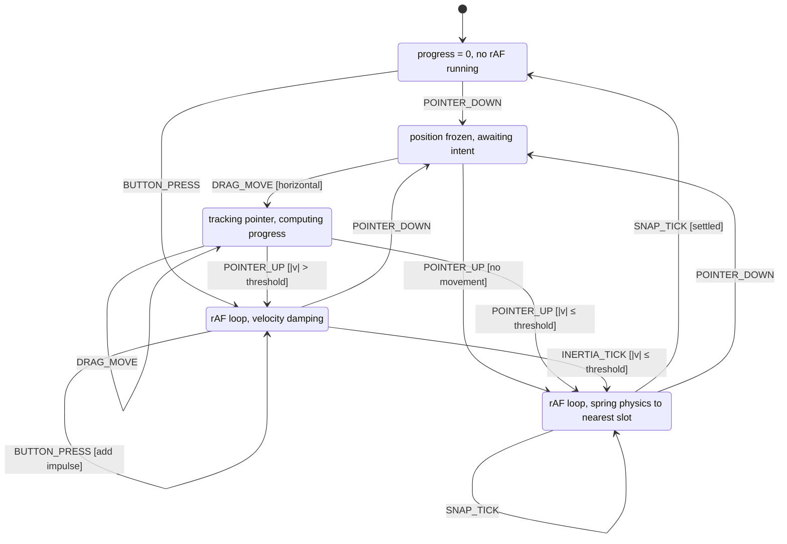

# Portfolio Slider — State Machine Refactoring

## Architecture

```
app/composables/
  useSliderMachine.ts     ← state machine (states, transitions, context)
  useSliderStyles.ts      ← pure style math (extracted from PortfolioSlider.vue)
  useSliderItems.ts       ← item windowing logic (getVisibleItems, wrapForSlider)

app/components/
  PortfolioSlider.vue     ← thin template + wiring (composables + template)
```

---

## State Machine

### Types

```typescript
type SliderState =
  | { type: "idle" }
  | { type: "pressed"; frozenProgress: number }
  | { type: "dragging"; progress: number; stepOffset: number }
  | { type: "inertia"; velocity: number; progress: number; frameId: number }
  | {
      type: "snapping";
      velocity: number;
      progress: number;
      target: number;
      frameId: number;
    };

type SliderEvent =
  | { type: "POINTER_DOWN" }
  | {
      type: "DRAG_MOVE";
      movementX: number;
      pixelsPerStep: number;
      dirY: number;
    }
  | { type: "POINTER_UP"; releaseVelocity: number }
  | { type: "BUTTON_PRESS"; direction: 1 | -1 }
  | { type: "INERTIA_TICK"; timestamp: number }
  | { type: "SNAP_TICK"; timestamp: number };
```

### Diagram



### Transition table

| From       | Event          | Guard                      | To         | Actions                                             |
| ---------- | -------------- | -------------------------- | ---------- | --------------------------------------------------- |
| `idle`     | `POINTER_DOWN` | items ≥ 2, not button      | `pressed`  | `stopAnimation()`, freeze progress=0                |
| `idle`     | `BUTTON_PRESS` | items ≥ 2                  | `inertia`  | compute impulse, `startInertiaLoop()`               |
| `pressed`  | `DRAG_MOVE`    | `dirY < 0.35` (horizontal) | `dragging` | init progress from movement                         |
| `pressed`  | `POINTER_UP`   | —                          | `snapping` | `startSnapLoop(frozenProgress)`                     |
| `dragging` | `DRAG_MOVE`    | —                          | `dragging` | update progress, shift items on step boundary       |
| `dragging` | `POINTER_UP`   | `\|v\| > minVelocity`      | `inertia`  | `startInertiaLoop(releaseVelocity)`                 |
| `dragging` | `POINTER_UP`   | `\|v\| ≤ minVelocity`      | `snapping` | `startSnapLoop(progress)`                           |
| `inertia`  | `INERTIA_TICK` | `\|v\| > minVelocity`      | `inertia`  | dampen, advance progress, shift items on ±1 cross   |
| `inertia`  | `INERTIA_TICK` | `\|v\| ≤ minVelocity`      | `snapping` | `stopAnimation()`, `startSnapLoop(progress)`        |
| `inertia`  | `BUTTON_PRESS` | —                          | `inertia`  | `velocity += impulse` (no new loop)                 |
| `inertia`  | `POINTER_DOWN` | items ≥ 2, not button      | `pressed`  | `stopAnimation()`, freeze current progress          |
| `snapping` | `SNAP_TICK`    | not settled                | `snapping` | spring physics step                                 |
| `snapping` | `SNAP_TICK`    | settled                    | `idle`     | `commitShift(target)`, reset all, `stopAnimation()` |
| `snapping` | `POINTER_DOWN` | items ≥ 2, not button      | `pressed`  | `stopAnimation()`, freeze current progress          |

### Side effects (enter/exit)

| State        | onEnter                                                                 | onExit                          |
| ------------ | ----------------------------------------------------------------------- | ------------------------------- |
| **idle**     | `commitShift(target)` if target ≠ 0; reset progress/velocity/stepOffset | —                               |
| **pressed**  | `cancelAnimationFrame` if any running                                   | —                               |
| **dragging** | —                                                                       | —                               |
| **inertia**  | `requestAnimationFrame(inertiaTick)`                                    | `cancelAnimationFrame(frameId)` |
| **snapping** | compute `target = round(progress)`, `requestAnimationFrame(snapTick)`   | `cancelAnimationFrame(frameId)` |

### Physics constants

```typescript
const PHYSICS = {
  velocityInfluence: 1.35,
  maxInertiaVelocity: 0.035,
  inertiaDamping: 0.94,
  minInertiaVelocity: 0.002,
  buttonImpulseVelocity: 0.005,
  snapSpringStiffness: 500,
  snapSpringDamping: 20,
  snapStopEpsilon: 0.002,
  snapStopVelocity: 0.01,
} as const;
```

---

## Refactoring plan

### Step 1: Extract pure style functions → `useSliderStyles.ts`

Move from PortfolioSlider.vue (no behavior change):

- `NumericStyle` type
- `clamp`, `lerp`
- `getBaseParams` (accepts `windowSize` param instead of reading computed)
- `getVisibleStyleValues`, `buildStyle`, `interpolateStyle`
- `getFirstInvisibleStyle`, `getLastInvisibleStyle`, `getInterpolatedStyle`
- `applyProgressStyles`

**Verify:** slider looks and animates identically.

### Step 2: Extract item windowing → `useSliderItems.ts`

Move from PortfolioSlider.vue (no behavior change):

- `SliderItem` type
- `getVisibleItems`
- `wrapForSlider`

**Verify:** items render in correct order with correct IDs.

### Step 3: Create state machine → `useSliderMachine.ts`

New composable implementing the diagram above:

- Single `state` ref with discriminated union type `SliderState`
- `send(event: SliderEvent)` — flat switch on `state.type` × `event.type`
- rAF loops started/stopped in transition logic (enter/exit)
- `shiftProjectsBy`, `commitShift` as internal actions
- Exposes: `state`, `send`, `selectedIndex`, `sliderItems` (styled)
- Consumes: `useSliderStyles`, `useSliderItems`

**Verify:** all transitions match the diagram. Console.log state changes for debug.

### Step 4: Rewire PortfolioSlider.vue

- Replace 6 scattered refs with `useSliderMachine(projects, renderLimit)`
- `dragHandler` → thin adapter mapping gesture events to `send()`:
  - `event.first` → `send({ type: 'POINTER_DOWN' })`
  - `event.dragging` → `send({ type: 'DRAG_MOVE', ... })`
  - `event.last` → `send({ type: 'POINTER_UP', releaseVelocity })`
- `goToNextItem` → `send({ type: 'BUTTON_PRESS', direction: 1 })`
- `goToPrevItem` → `send({ type: 'BUTTON_PRESS', direction: -1 })`
- Template stays unchanged

**Verify:** drag, inertia, snap, buttons all work. Test interrupting animations.

### Step 5: Cleanup

- Remove dead code (`isDragging`, `dragProgress`, etc.)
- Remove `console.log` calls
- Final behavior comparison with original

---

## File mapping: current → new

| Current (PortfolioSlider.vue lines) | New file              | Notes                      |
| ----------------------------------- | --------------------- | -------------------------- |
| 5-12: `SliderItem` type             | `useSliderItems.ts`   | exported type              |
| 14-23: `NumericStyle` type          | `useSliderStyles.ts`  | exported type              |
| 46-52: 6 state refs                 | `useSliderMachine.ts` | → single `SliderState` ref |
| 55-66: physics constants            | `useSliderMachine.ts` | → `PHYSICS` object         |
| 92-120: `getVisibleItems`           | `useSliderItems.ts`   | pure function              |
| 122-200: `wrapForSlider`            | `useSliderItems.ts`   | pure function              |
| 203-258: `dragHandler`              | `PortfolioSlider.vue` | thin adapter → `send()`    |
| 260-295: button handlers            | `PortfolioSlider.vue` | one-liners → `send()`      |
| 297-315: `shiftProjectsBy`          | `useSliderMachine.ts` | internal action            |
| 317-376: `finishWithSnap`           | `useSliderMachine.ts` | `snapping` enter logic     |
| 378-420: `startInertia`             | `useSliderMachine.ts` | `inertia` enter logic      |
| 422-430: `getShiftedProjectsBy`     | `useSliderMachine.ts` | internal helper            |
| 432-446: `applyProgressStyles`      | `useSliderStyles.ts`  | pure function              |
| 448-580: style math functions       | `useSliderStyles.ts`  | pure functions             |
| 582-600: movement helpers           | `useSliderMachine.ts` | `truncateTowardZero`, etc. |
| 602-610: `stopInertia`              | `useSliderMachine.ts` | folded into transitions    |
